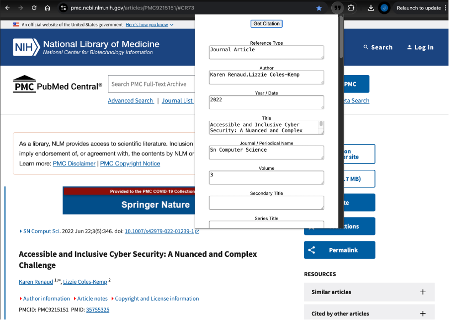

## Get Ref AI

Get Ref AI is a Chrome extension backed by a lightweight Express server that turns the metadata of the current tab into an EndNote-compatible citation. The popup gathers `<head>` data, posts it to the local server, and the server calls Google’s Gemini API, sanitises the JSON, and sends it back so you can review or download the `.enw` file.



---

### Features

- One-click capture of the active tab’s metadata (titles, meta tags, JSON-LD, authors, etc.).
- Local proxy server keeps the Gemini API key off the client and enforces payload validation.
- Popup displays the parsed EndNote fields for manual edits before download.
- Produces `.enw` files with the correct `%` tags for EndNote import.

---

### Project Structure

```
get-ref-ai/
├─ extensions/           # Vite + CRX powered Chrome extension
│  ├─ src/
│  │  ├─ popup/         # Popup UI, download helpers, server client
│  │  └─ content/       # Functions injected into the active tab
│  └─ manifest.config.js
├─ server/               # Express proxy + Gemini client
│  ├─ main.js           # Entry point (loads env, boots server)
│  ├─ api.js            # Route definition and request validation
│  ├─ llm.js            # Generic LLM client (Gemini payload today)
│  └─ parse-response.js # Cleans & parses Gemini output
├─ .env                  # Environment variables (not committed)
└─ screen-shot.png       # Popup preview
```

---

### Requirements

- Node.js 18+ (native `fetch`, ES modules).
- Chrome/Chromium for loading the extension.
- Google Gemini API key with `gemini-2.0-flash` access.

---

### Setup

1. **Install dependencies**
   ```bash
   cd server && npm install
   cd ../extensions && npm install
   ```
2. **Create `.env` at the repo root**
   ```bash
   GEMINI_API_KEY=your_api_key
   GEMINI_API_PATH=https://generativelanguage.googleapis.com/v1beta/models/gemini-2.0-flash:generateContent
   PORT=3000   # optional override for the Express server
   ```

---

### Running the local server

```bash
cd server
node main.js
```

`main.js` loads `.env`, builds the Express app (with CORS + JSON body parsing) and exposes `POST /citation`. Leave this process running whenever you use the extension.

---

### Using the extension in development

1. Start Vite so the popup reloads on save:
   ```bash
   cd extensions
   npm run dev
   ```
2. Open `chrome://extensions`, enable **Developer mode**, and **Load unpacked** → `extensions/dist`.
3. The popup initially shows a “Vite Dev Mode” splash with a dev URL. Open that URL in a normal browser tab to interact with the live popup while coding. (Alternatively run `npm run build` for a production-ready popup directly in Chrome.)

---

### Production build

```bash
cd extensions
npm run build
```

Vite outputs the packed extension to `extensions/dist/`. Use `vite-plugin-zip-pack`’s artifact under `extensions/release/` if you need a distributable ZIP for the Chrome Web Store.

---

### How the pieces work together

1. Popup loads `extensions/src/popup/index.js`, which injects `getUrlMetaData` into the active tab via `chrome.scripting`.
2. Clicking **Get Citation** posts the combined metadata to `http://localhost:3000/citation`.
3. `server/api.js` validates the payload, builds the Gemini prompt, and calls the injected `Llm` instance.
4. `parse-response.js` strips any formatting noise from Gemini’s reply and returns strict JSON ready for EndNote tags.
5. The popup populates the EndNote fields, lets you make edits, and `package-for-download.js` converts them into a `.enw` download.

---

### Troubleshooting

- **`GEMINI_API_KEY is not set`** – ensure `.env` is at the repo root and `node server/main.js` is launched from `get-ref-ai/`.
- **Popup never loads** – run `npm run build` first or keep `npm run dev` running so the dev URL resolves.
- **`Failed to fetch data from LLM API`** – check the server console for the detailed error (invalid key, quota, malformed metadata).
- **Downloads empty or malformed** – confirm Gemini returned valid JSON; `parse-response` logs errors in the server terminal if the JSON can’t be parsed.

---

### Possible Next Steps

- Add schema validation (e.g., Zod) before returning the citation JSON.
- Improve the popup UI (loading states, multi-error display, field reordering).
- Expand the `Llm` class to support alternative models or retry policies.
- Add automated tests for `parse-response` and the metadata collector using sample HTML in `meta_data_sample.txt`.

Happy citing! 📚

\*README generated using Codex.
